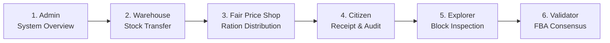

# PDSChain — Quick Demonstration & Viva Guide

This guide provides a structured, step-by-step walkthrough for presenting **PDSChain (Public Distribution System Blockchain)** in 5 to 10 minutes.

---

## 1. How to Start PDSChain

### Prerequisites
* **Node.js**: v18+ (tested on v24)
* **Shell**: Windows PowerShell or Command Prompt

### Step 1: Open Terminal in Project Root
```powershell
cd "d:\Blockchain Project\backend"
```

### Step 2: Start the Backend Server
```powershell
node src/server.js
```

### Expected Startup Output
```text
[INFO] Server running on port 3000
[INFO] SQLite database connected at database/pdschain.sqlite
[INFO] 12 Institutional FBA Validators registered in consensus engine
[INFO] Health probes active at /health/live, /health/ready, /health/startup
[INFO] Prometheus metrics exported at /metrics
```

> **Note**: The backend automatically serves the frontend static portals, REST APIs, JSON-RPC 2.0 endpoints, and blockchain explorer. No separate web server is required.

---

## 2. Exact URL to Open

Open any modern browser (Chrome, Edge, Firefox) at:

$$\mathbf{http://localhost:3000/}$$

* Direct portal shortcuts:
  * **Landing Page**: `http://localhost:3000/`
  * **Login Portal**: `http://localhost:3000/login.html`
  * **Admin Operations**: `http://localhost:3000/admin/admin.html`
  * **Warehouse Depot**: `http://localhost:3000/warehouse/warehouse.html`
  * **Fair Price Shop**: `http://localhost:3000/shop/shop.html`
  * **Citizen Portal**: `http://localhost:3000/citizen/citizen.html`
  * **Pro Blockchain Explorer**: `http://localhost:3000/explorer/`
  * **Ledger Overview & Chain Flow**: `http://localhost:3000/blockchain.html`
  * **Validator Telemetry**: `http://localhost:3000/validator/validator.html`

---

## 3. Demo Credentials for Each Role

The login page (`/login.html`) includes a **"Select Role (Quick Fill)"** dropdown that automatically populates the credentials for convenience:

| Role | Username | Password | Identity / Scope | Destination Portal |
| :--- | :--- | :--- | :--- | :--- |
| **System Administrator** | `admin` | `admin123` | Ministry of Food & Civil Supplies | `admin/admin.html` |
| **Warehouse Officer** | `warehouse` | `warehouse123` | `WH-003` (Chennai Central Depot) | `warehouse/warehouse.html` |
| **Fair Price Shop Officer**| `shop` | `shop123` | `FPS-102` (Central Bazaar Ration Shop) | `shop/shop.html` |
| **Citizen Beneficiary** | `citizen` | `citizen123` | `BEN-1024` (Arun Kumar, 4-person family) | `citizen/citizen.html` |
| **Validator Node** | `validator` | `validator123` | `NODE-07` (Public Audit & Governance) | `validator/validator.html` |

---

## 4. Recommended 5–10 Minute Demonstration Flow



1. **Admin (1.5 mins)**: Show institutional oversight, 100 beneficiaries, Fair Price Shops, and warehouses.
2. **Warehouse (1.5 mins)**: Dispatch bulk stock to a Fair Price Shop; observe on-chain transfer logging.
3. **Fair Price Shop (2 mins)**: Execute a 6-step grain distribution; demonstrate real-time 12-validator FBA consensus animation and receipt generation.
4. **Citizen (1.5 mins)**: Show entitlement quota transparency and verify transaction cryptographic proof.
5. **Blockchain Explorer (1.5 mins)**: Inspect the newly sealed block, Merkle root, state root, and validator signatures.
6. **Validator Node (1 min)**: Show the 12-node Byzantine quorum matrix, instant finality, and synchronized ledger state.

---

## 5. Exact Clicks & Actions for Each Role

### Role 1: System Administrator
1. Go to `http://localhost:3000/login.html`.
2. Select **"Administrator"** from the *Quick Fill* dropdown (or enter `admin` / `admin123`) and click **Sign In**.
3. **Admin Dashboard**:
   * Point out high-level KPI cards: *Active Beneficiaries (100)*, *Fair Price Shops (20)*, *Warehouses (5)*, *Consensus Quorum (12/12)*.
4. Click **Beneficiaries** in the left sidebar:
   * In the search box, type `Arun` $\rightarrow$ shows `BEN-1024` (Arun Kumar, Priority Cardholder).
5. Click **Fair Price Shops** $\rightarrow$ shows network of 20 ration distribution shops.
6. Click **Warehouses** $\rightarrow$ shows 5 state silos including `WH-003`.
7. Click **Transactions** in sidebar $\rightarrow$ click the blue **Details** button on any transaction to open the cryptographic inspection modal.
8. Click **Sign Out** in the top right user menu.

---

### Role 2: Regional Warehouse Depot (`WH-003`)
1. Go to `http://localhost:3000/login.html`.
2. Select **"Warehouse Officer"** from dropdown (or enter `warehouse` / `warehouse123`) and click **Sign In**.
3. In the sidebar, click **Transfers**.
4. Click the blue **"+ Create Transfer"** button:
   * **Destination Shop**: Select `FPS-102 (Central Bazaar FPS)`
   * **Commodity**: Select `Rice`
   * **Quantity**: Enter `25` (KG)
   * **Remarks**: Enter `Viva Demo Dispatch Batch #101`
5. Click **"Submit On-Chain Transfer"**.
6. **Result**: The modal closes, a success toast appears, and the new transfer is immediately listed in the table with status **CONFIRMED** on the blockchain ledger.
7. Click **Sign Out**.

---

### Role 3: Fair Price Shop Officer (`FPS-102`)
1. Go to `http://localhost:3000/login.html`.
2. Select **"Fair Price Shop Officer"** from dropdown (or enter `shop` / `shop123`) and click **Sign In**.
3. Click **"Grain Distribution"** (or open `/shop/distribution.html`).
4. Walk through the **6-Step Interactive Stepper**:
   * **Step 1 (Beneficiary Lookup)**: Enter `BEN-1024` and click **"Verify & Proceed"**.
     * *Observation*: Card displays Arun Kumar, Family Size: 4, remaining monthly quotas.
   * **Step 2 (Commodity)**: Select `Rice` and click **Next**.
   * **Step 3 (Quantity)**: Enter `5` (KG) and click **Next**.
   * **Step 4 (Confirmation)**: Review summary card and click **"Authenticate & Submit to Blockchain"**.
   * **Step 5 (Consensus Animation)**: Watch the live 7-stage Byzantine consensus pipeline:
     1. Digital signature created (Ed25519)
     2. Pre-state simulation verified
     3. Validator votes broadcast
     4. Quorum slices evaluated
     5. 12/12 Validator consensus reached
     6. Merkle root computed and block sealed
     7. Instant finality achieved
   * **Step 6 (Receipt)**: Official cryptographic receipt renders with unique Transaction ID (`TXN-...`), timestamp, block height, and QR code placeholder.
5. Click **Sign Out**.

---

### Role 4: Citizen Beneficiary (`BEN-1024`)
1. Go to `http://localhost:3000/login.html`.
2. Select **"Citizen / Beneficiary"** from dropdown (or enter `citizen` / `citizen123`) and click **Sign In**.
3. **Citizen Dashboard**:
   * Note personalized greeting: *"Welcome, Arun Kumar (BEN-1024)"*.
   * View live entitlement balance cards (Rice, Wheat, Sugar quotas updated).
4. Click **"Distribution History"** $\rightarrow$ shows immutable table of all grain receipts.
5. Click **"Verify Hash"** (or open `/citizen/verify.html`):
   * Click **"Verify Authenticity"** $\rightarrow$ green badge displays: *"Verified on Blockchain Ledger"*, displaying block height, cryptographic hash, and 12/12 validator consensus certification.
6. Click **Sign Out**.

---

### Role 5: Professional Blockchain Explorer
1. Navigate directly to `http://localhost:3000/explorer/`.
2. Point out:
   * **Finalized Height**: Shows current block number (e.g. `#19`).
   * **Consensus Quorum**: 12 / 12 Operational.
   * **Throughput / Finality**: Instant block sealing.
3. In the top search bar, type `VAL-01` $\rightarrow$ instant dropdown resolves Validator Node 01 (Ministry of Consumer Affairs).
4. Open `http://localhost:3000/blockchain.html`:
   * Point out the **Cryptographic Block Chain Sequence** where every block references the SHA-256 hash of its predecessor.
   * Highlight the green **`CHAIN VALID`** badge (real-time Merkle and parent-hash integrity check).

---

### Role 6: Validator Quorum Telemetry
1. Open `http://localhost:3000/validator/validator.html`.
2. Highlight:
   * **FBA Quorum Vote Matrix**: 12 node tiles showing green *Agreed* checkmarks.
   * **Ledger Synchronization & Recovery Card**:
     * `SYNC STATE: CURRENT`
     * Durable Checkpoints active
     * EVM & Journal Replay: *State Root Valid*
   * Threshold requirements: 9 of 12 votes required (75% BFT threshold) to tolerate up to 3 Byzantine or offline nodes.

---

## 6. What Blockchain / Consensus Result Appears After Each Transaction

| Action | Blockchain Action Behind the Scenes | Visible UI Result |
| :--- | :--- | :--- |
| **Warehouse Stock Transfer** | 1. StateManager verifies depot balance.<br/>2. Proposal submitted to 12 validators.<br/>3. Sealed into new block with state root update. | Table row added with transfer ID, status `CONFIRMED`, and block reference. |
| **Shop Grain Distribution** | 1. Ed25519 signature generated by shop key.<br/>2. Anti-replay nonce checked.<br/>3. Quorum slices evaluate proposal.<br/>4. 12/12 sign consensus certificate.<br/>5. Dual Merkle & State roots committed. | Stepper transitions to Step 6. Official receipt displays Transaction ID, Block #, and FBA 12/12 validation stamp. |
| **Citizen Hash Verification** | Queries ledger by Transaction ID and checks cryptographic inclusion. | Green badge: *"Verified on Blockchain Ledger"* with timestamp and SHA-256 hash. |

---

## 7. Important Pages to Show During the Presentation

1. **`http://localhost:3000/`** (Landing page with platform architecture overview).
2. **`http://localhost:3000/admin/admin.html`** (Admin dashboard, 100 beneficiaries, search filtering).
3. **`http://localhost:3000/shop/distribution.html`** (The primary 6-step citizen grain distribution wizard).
4. **`http://localhost:3000/explorer/`** (Enterprise blockchain explorer).
5. **`http://localhost:3000/blockchain.html`** (Visual block sequence cards and mempool staging).
6. **`http://localhost:3000/validator/validator.html`** (12-node FBA quorum voting matrix).
7. **`http://localhost:3000/citizen/verify.html`** (Cryptographic proof checker for beneficiaries).

---

## 8. Common Harmless Warnings vs. Actual Errors

### Harmless Warnings (Expected during normal operation):
* **`404 /favicon.ico`**: Browser requesting a browser tab icon; does not affect application functionality.
* **`POST /api/auth/login 401`**: Expected when intentionally testing wrong password rejection on the login screen.
* **`[FBA-CONSENSUS] Vote rejected: CONFLICTING_VOTE`**: Normal Byzantine agreement safety rule rejecting competing duplicate votes in the same round.
* **`SSE stream reconnecting`**: Occurs briefly when switching between pages; automatically reconnects.

### Actual Errors (Require attention):
* **`EADDRINUSE: port 3000`**: Another server instance is already running. Stop existing Node processes before restarting.
* **`SQLITE_BUSY: database is locked`**: Multiple writers trying to write concurrently without WAL mode enabled.
* **`UnhandledPromiseRejection`**: Unhandled exception in backend logic.

---

## 9. How to Stop the Server Safely

### Option A: Standard Keyboard Interrupt
In the terminal running `node src/server.js`, press:
$$\mathbf{Ctrl + C}$$

### Option B: Windows PowerShell Process Termination
If the process is running in the background:
```powershell
Get-Process node | Where-Object { $_.MainWindowTitle -like "*server*" -or $_.CommandLine -like "*server.js*" } | Stop-Process -Force
```
Or to kill all Node processes:
```powershell
Stop-Process -Name node -Force
```

---

## 10. Key Features to Explain During a Viva

When asked questions by examiners, highlight these technical highlights:

1. **Permissioned Consortium Model**:
   * Unlike public blockchains (e.g. Bitcoin/Ethereum) where anyone can mine, PDSChain uses a permissioned consortium of institutional stakeholders (Civil Supplies Ministry, Food Corporation of India, State Warehouses, Fair Price Shops, and Citizens).
2. **Federated Byzantine Agreement (FBA)**:
   * Energy-efficient consensus mechanism inspired by the Stellar Consensus Protocol.
   * Uses 12 institutional validator nodes grouped into intersecting quorum slices.
   * Requires a quorum threshold ($\ge 9$ of 12 nodes, or 75%) to finalize transactions in $< 3$ seconds without gas fees or mining.
3. **Dual Cryptographic Roots**:
   * Every block seals two distinct roots:
     * **Merkle Root**: Cryptographic proof of all distribution transactions in that block.
     * **State Root**: Global snapshot hash of all citizen monthly quota balances and shop inventories.
4. **Ed25519 Asymmetric Digital Signatures**:
   * Every actor (Warehouse Officer, Shop Dealer, Validator) possesses an Ed25519 keypair.
   * Transactions are signed with the sender's private key, preventing spoofing or repudiation.
5. **Anti-Fraud & Entitlement Enforcement**:
   * Built-in nonce checking prevents transaction replay attacks.
   * Smart contract rules strictly reject transactions where requested quota exceeds the citizen's remaining monthly entitlement.
6. **Crash Recovery & Durable Outbox Subsystem**:
   * Uses the Transactional Outbox Pattern to ensure ledger event records are never lost during server restarts.
   * Durable checkpoints allow nodes to replay journals and synchronize state seamlessly.
7. **Observability & Health Monitoring**:
   * Kubernetes-ready probes (`/health/live`, `/health/ready`, `/health/startup`).
   * Prometheus-compliant metric scrapers (`/metrics`).
8. **Layer 2 EVM Execution Option**:
   * Includes Solidity contracts (`PDSChainCore.sol`) compiled and tested with Hardhat (20 automated tests), providing dual compatibility with standard Web3 Ethereum tooling.

