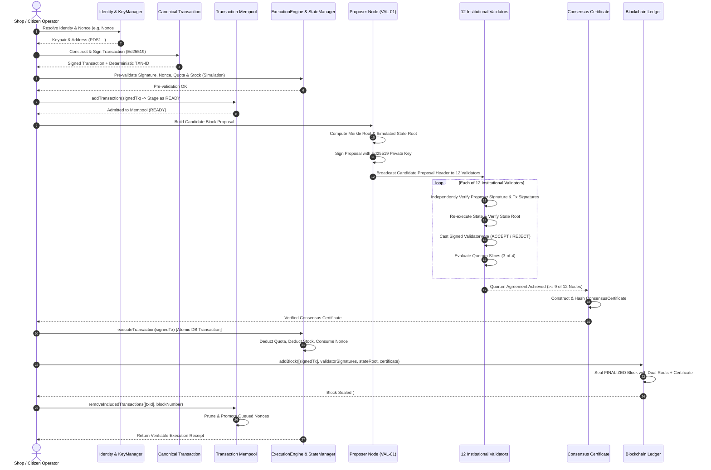

# PDSChain Architecture Specification

## Overview

**PDSChain** is a permissioned, application-specific, blockchain-based Public Distribution System platform. It is engineered to provide end-to-end transparency, auditability, and tamper-proof verification for essential food grain allocation, Fair Price Shop distribution, and warehouse logistics.

> [!IMPORTANT]
> **Transaction signatures provide transaction authenticity and integrity. FBA remains the consensus mechanism.**
> 
> **PDSChain is Ethereum-inspired in selected blockchain architecture concepts, but it is not an Ethereum network and does not use Ethereum consensus.**
> 
> Key Characteristics:
> - **Permissioned**: Validator participation is governed by institutional identities.
> - **Application-Specific**: Tailored specifically for public distribution governance, ration entitlements, and inventory integrity.
> - **PDS-Focused**: Native state models represent Beneficiaries, Fair Price Shops, Warehouses, and Commodities.
> - **Cryptographically Signed**: Every transaction is signed via native Ed25519 digital signatures and protected by sequential nonces.
> - **Triple Cryptographic Commitments**: Every block header anchors `merkleRoot` (transaction commitment), `receiptsRoot` (execution receipts commitment), and `stateRoot` (composite world state commitment).
> - **Cryptographic Consensus Certificates**: Every finalized block contains signed validator vote approvals and an FBA consensus certificate.
> - **Native Solidity Smart Contracts & Embedded EVM**: Runs genuine Solidity contracts (`0.8.24`, Cancun) embedded via `@ethereumjs/vm` (chainId: 1729).
> - **Zero-Cryptocurrency & Zero-Fee Model**: Operates strictly on subsidized public distribution quotas; zero native token, zero currency, zero transaction fees. Gas is used purely as an execution resource cap and watchdog.
> - **Federated Byzantine Agreement (FBA)**: Zero energy-waste mining; consensus is achieved via 12 institutional validators with 3-of-4 quorum slices and 9-of-12 threshold.

---

## 5-Layer Platform Architecture

```
PDSChain
│
├── 1. Application Layer
│   ├── Citizen / Beneficiary Management & Monthly Quotas
│   ├── Fair Price Shop (FPS) Point-of-Sale Operations
│   ├── Central / Regional Warehouse Logistics & Transfers
│   ├── Commodity Catalog & Subsidized Pricing
│   └── RBAC, Authentication & REST API Controllers
│
├── 2. Blockchain & Identity Layer
│   ├── Cryptographic Identities & Ed25519 Key Pairs (`keyManager.js`, `Identity.js`)
│   ├── Asymmetric Digital Signatures & Domain Separation (`signature.js`)
│   │   ├── `PDSCHAIN_TX_V1` (Transaction signatures)
│   │   ├── `PDSCHAIN_BLOCK_V1` (Block proposal signatures)
│   │   └── `PDSCHAIN_VOTE_V1` (Validator vote signatures)
│   ├── Canonical Serialization & Deterministic IDs (`serialization.js`)
│   ├── Transaction Mempool Module (`backend/src/blockchain/mempool/`)
│   │   ├── `Mempool.js` (Admission pipeline, candidate selection, queued promotion)
│   │   ├── `MempoolEntry.js` (Lifecycle states: READY, QUEUED, INCLUDED, EXPIRED)
│   │   ├── `MempoolPolicy.js` (Configurable capacity, per-sender limits, TTL)
│   │   └── `MempoolErrors.js` (Structured error codes)
│   ├── Deterministic Consensus State Root Module (`backend/src/blockchain/state/`)
│   │   ├── `stateSerializer.js` (Canonical serialization & SHA-256 stateRoot)
│   │   └── `stateConsistency.js` (World state invariant & integrity verification)
│   ├── Signed Blockchain Transaction (`Transaction.js`)
│   ├── Cryptographic Block Representation with Dual Roots & Certificates (`Block.js`)
│   ├── Sequential Blockchain Ledger (`Blockchain.js`)
│   ├── SHA-256 Block Header, Proposal & Payload Hashing (`hashing.js`)
│   ├── Merkle Tree & Merkle Root Calculations (`merkle.js`)
│   └── Ledger Cryptographic Integrity Validation (`validation.js`)
│
├── 3. Execution Layer
│   ├── Execution Boundary & Dispatcher (`ExecutionEngine.js`)
│   ├── Deterministic Execution Context (`ExecutionContext.js`)
│   ├── Structured Execution Receipts & Ordered Diffs (`ExecutionReceipt.js`)
│   ├── World State Access, Sender Nonce Tracking & State Snapshots (`StateManager.js`)
│   ├── Standardized Structured Error Codes (`errors/ExecutionErrors.js`)
│   ├── Modular Domain Rules (`rules/`)
│   │   ├── `BaseRule.js` (Rule contract interface)
│   │   ├── `AuthorizationRule.js` (Actor permission validation)
│   │   ├── `EntitlementRule.js` (Citizen quota allowances & deductions)
│   │   ├── `InventoryRule.js` (Shop stock management & zero-stock guards)
│   │   ├── `DistributionRule.js` (Atomic composite grain distribution)
│   │   ├── `WarehouseTransferRule.js` (Atomic logistics transfers & audit logging)
│   │   └── `ContractCallRule.js` (EVM smart contract invocation & receipt binding)
│   └── Embedded EVM Runtime Adapter (`backend/src/evm/`)
│       ├── `EVMRuntime.js` (Embedded @ethereumjs/vm, Cancun hardfork, chainId 1729)
│       ├── `EVMStateAdapter.js` (Copy-on-write state checkpoints, rollback & evmStateRoot)
│       ├── `ContractRegistry.js` (Hardhat artifact loader & address lookup)
│       ├── `ABIEncoder.js` (Deterministic ABI encoding, decoding, log parsing)
│       ├── `ExecutionGasPolicy.js` (Execution gas caps: 1M tx gas limit, 10M block gas limit)
│       ├── `EVMReceipt.js` (Deterministic execution receipts & receiptHash)
│       └── `identityBridge.js` (Ed25519 identity to deterministic 20-byte EVM address bridge)
│   └── Native Solidity Smart Contracts (`contracts/contracts/`)
│       ├── `core/AccessControl.sol` & `core/PDSRegistry.sol`
│       ├── `registry/BeneficiaryRegistry.sol` (Zero-PII pseudonymous citizen registry)
│       ├── `registry/ShopRegistry.sol` & `registry/WarehouseRegistry.sol`
│       ├── `registry/CommodityRegistry.sol`
│       ├── `inventory/InventoryManager.sol` & `inventory/EntitlementManager.sol`
│       └── `distribution/DistributionManager.sol` (Atomic grain disbursement)
│
├── 4. Consensus Layer
│   ├── Federated Byzantine Agreement Engine (`FBAConsensus.js`)
│   ├── 12 Institutional Validator Topology (`consensusConfig.js`)
│   ├── Validator Node Representation & Independent Execution Checks (`ValidatorNode.js`)
│   ├── Dedicated Signed Validator Vote Model (`ValidatorVote.js`)
│   ├── In-Memory Consensus Vote Store & Conflict Protection (`VoteStore.js`)
│   ├── Cryptographic Consensus Certificate & Standalone Verifier (`ConsensusCertificate.js`)
│   ├── Individual Trust Quorum Slices (`QuorumSlice.js`)
│   └── Dynamic Network Quorum Finding & Evaluation (`Quorum.js`)
│
└── 5. Network Layer
    ├── Inter-Validator Communication Protocol
    ├── Proposal Broadcast & Vote Gossip Transport
    └── HTTP Transport & Peer Synchronization
```

---

## Transaction Lifecycle & Consensus Pipeline

```
                 TRANSACTION
                      ↓
                 SIGNATURE
                      ↓
                   MEMPOOL
                      ↓
              EXECUTION ENGINE
                      ↓
              STATE TRANSITION
                      ↓
               CANDIDATE BLOCK
                /           \
               ↓             ↓
        MERKLE ROOT       STATE ROOT
               \             /
                ↓           ↓
                BLOCK PROPOSAL
                      ↓
              PROPOSER SIGNATURE
                      ↓
             VALIDATOR VERIFICATION
                      ↓
              SIGNED VALIDATOR VOTES
                      ↓
                 FBA QUORUM
                      ↓
            CONSENSUS CERTIFICATE
                      ↓
                 FINALIZATION
                      ↓
                BLOCK COMMIT
                      ↓
                STATE COMMIT
```



---

## Database Separation

PDSChain maintains a clean conceptual separation of persistence responsibilities:

1. **Blockchain Ledger (`blocks`, `transactions`)**:
   - Immutable historical record of finalized blocks, Merkle roots (`merkleRoot`), State roots (`stateRoot`), proposer signatures, Consensus Certificates (`consensusCertificate`), and cryptographically sealed transactions.
2. **Application / State Database (`beneficiaries`, `shops`, `warehouses`, `inventory`, `users`, `stock_transfers`)**:
   - Indexed operational state, monthly entitlements, stock balances, sender nonces, and authentication records.
3. **In-Memory Mempool & Vote Store**:
   - Ephemeral pre-consensus staging area for unconfirmed transactions and consensus round vote deduplication.
