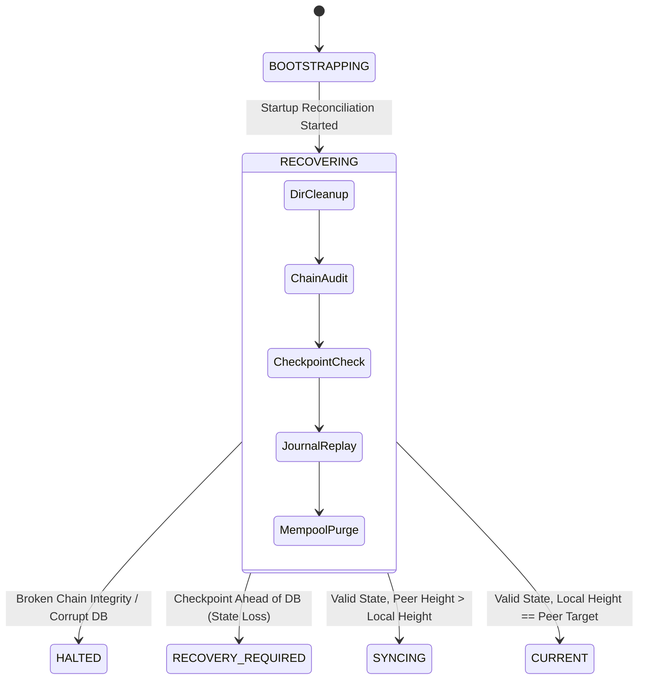

# PDSChain Phase 10: Crash Safety & Recovery Model

## 1. Overview & Failure Classification

Distributed validators operating in a production or institutional consortium environment are subject to unpredictable system halts. PDSChain implements a **deterministic crash-safety and startup recovery architecture** designed to withstand:

1. **Clean Process Termination**: Graceful SIGINT/SIGTERM signals where resources, open file descriptors, and in-flight journal writes flush cleanly.
2. **Abrupt Process Crash**: `SIGKILL`, OOM (Out Of Memory) aborts, or kernel panics occurring mid-block execution, mid-round voting, or mid-journal write.
3. **Hardware & Power Faults**: Sudden power loss causing partial disk writes or un-fsynced temporary files.
4. **Filesystem / Media Corruption**: Partial bit-flips or truncated lines in the append-only consensus journal or database file.

---

## 2. Storage Tier Architecture & Durability

Each validator process (`VAL-01` to `VAL-12`) maintains four isolated storage tiers:

```
┌─────────────────────────────────────────────────────────────┐
│                    Validator Process                        │
└──────┬─────────────────┬───────────────────┬────────────────┘
       │                 │                   │
       ▼                 ▼                   ▼
┌──────────────┐  ┌──────────────┐   ┌──────────────┐
│ SQLite DB    │  │ Consensus    │   │ Checkpoint   │
│ (WAL Mode)   │  │ Journal      │   │ Manager      │
│ Blocks & Txs │  │ (.jsonl)     │   │ (.json/.tmp) │
└──────────────┘  └──────────────┘   └──────────────┘
```

1. **SQLite Database (`pdschain.sqlite`)**:
   - Stores finalized blocks, transactions, receipts, and state roots.
   - Configured with Write-Ahead Logging (`PRAGMA journal_mode = WAL`) and `PRAGMA synchronous = NORMAL/FULL` for crash-consistent relational durability.
2. **Consensus Journal (`consensus_journal.jsonl`)**:
   - Append-only newline-delimited JSON stream capturing FBA consensus state machine events: proposals, commit votes, and quorum certificates.
   - Designed for deterministic linear replay upon restart.
3. **Ledger Checkpoint (`checkpoints/checkpoint.json`)**:
   - Cryptographically hashed snapshot of the canonical finalized chain head.
   - Written using two-phase atomic replacement (`checkpoint.json.tmp` $\xrightarrow{\text{fsync}}$ `checkpoint.json`).
4. **EVM State Trie (`@ethereumjs/vm` / state-root)**:
   - Tracks world state (balances, nonces, storage slots for PDS smart contracts).
   - Reconstructible and verified against block header `stateRoot`.

---

## 3. Consensus Journal Corruption & Quarantine Protocol

When a node crashes during a disk write, the trailing entry of `consensus_journal.jsonl` may be partially written, resulting in invalid JSON syntax or truncated fields.

### Quarantine Sequence
`ConsensusJournal.js` handles corruption without manual human intervention or silent failure:

```
[Open consensus_journal.jsonl]
              │
              ▼
    [Read line-by-line]
              │
    ┌─────────┴─────────┐
    ▼                   ▼
[Valid JSON]    [Malformed Line]
    │                   │
[Add to Record List]    │
                        ▼
            [Stop Line Traversal]
                        │
                        ▼
  [Rename: consensus_journal.jsonl -> .corrupt.<timestamp>]
                        │
                        ▼
       [Write Valid Records to Fresh Journal]
                        │
                        ▼
     [Log CRITICAL Alert with Corrupt Line Preview]
```

### Invariants Preserved:
- **Zero Loss of Prior Finalized State**: All valid records preceding the corrupted line are fully recovered and preserved.
- **Forensic Auditability**: The malformed file is quarantined with an ISO timestamp (`consensus_journal.jsonl.corrupt.2026-09-17T09-20-00-000Z`) for post-incident debugging.
- **Active Round vs Finalized Commit Separation**: Unfinalized rounds (rounds lacking a 9-of-12 Quorum Certificate) are identified as active round attempts and discarded, preventing partial round bleed into the canonical chain.

---

## 4. Six-Step Startup Reconciliation Algorithm

The `LedgerRecoveryManager` (`backend/src/blockchain/sync/LedgerRecoveryManager.js`) orchestrates recovery on validator startup before any P2P listening sockets open or consensus messages are processed:

### Step 1: Directory Setup & Scratch Cleanup
- Verify and create directories: `database/validators/{validatorId}/checkpoints`.
- Scan for and delete orphan `.tmp` files (`checkpoint.json.tmp`) left by uncompleted writes during previous crashes.

### Step 2: Relational Blockchain Validation
- Execute `blockchain.validateChain()`.
- Verify every block from Genesis ($H=0$) to Chain Head ($H=N$):
  - SHA-256 block hash integrity.
  - Previous hash chain linkage: $\text{block}[i].\text{previousHash} = \text{block}[i-1].\text{hash}$.
  - Transaction Merkle root calculation against block transactions.
- If any block is invalid, transition `LedgerSyncState` to `HALTED` and refuse to boot.

### Step 3: Checkpoint Reconciliation
- Load latest checkpoint from `CheckpointManager`.
- If no checkpoint exists (fresh node or clean wipe), construct a canonical checkpoint from the Genesis block.
- Verify checkpoint invariant:
  $$H_{\text{checkpoint}} \le H_{\text{blockchain}}$$
- If $H_{\text{checkpoint}} > H_{\text{blockchain}}$, the database has suffered state regression or uncommitted block loss. The manager halts and enters `RECOVERY_REQUIRED`.

### Step 4: Consensus Journal Replay
- Stream and parse `consensus_journal.jsonl`.
- If corruption is detected, execute quarantine and valid-prefix recovery.
- Map highest committed Quorum Certificate height $H_{\text{journal}}$ against blockchain height $H_{\text{blockchain}}$.
- If journal committed height matches or exceeds blockchain height, verify that corresponding blocks exist in the database.

### Step 5: EVM State Root Reconciliation
- Compare highest committed block's `stateRoot` with EVM current state root.
- In Cancun EVM mode, verify that contract address nonce generation and PDS state roots match the deterministic block header.

### Step 6: Mempool Transaction Eviction
- Retrieve all transaction IDs finalized in the blockchain.
- Scan validator mempool / pending transaction cache.
- Evict any pending transaction already present in confirmed blocks, preventing replay rejection storms.

---

## 5. Crash Recovery State Transitions



---

## 6. Verification & Test Evidence

The crash safety model is verified by automated suites:
- `tests/sync-recovery-crash.test.js`:
  - Truncated journal line quarantine: 100% valid records preserved, `.corrupt` file produced.
  - Auto-creation of checkpoint following mid-execution crash.
  - `HALTED` state triggering upon tampered block payload.
  - `RECOVERY_REQUIRED` state triggering upon checkpoint-ahead anomaly.
  - Deterministic eviction of finalized transactions from mempool.
- Total recovery execution time: $< 25\text{ ms}$ for typical local validator databases.

