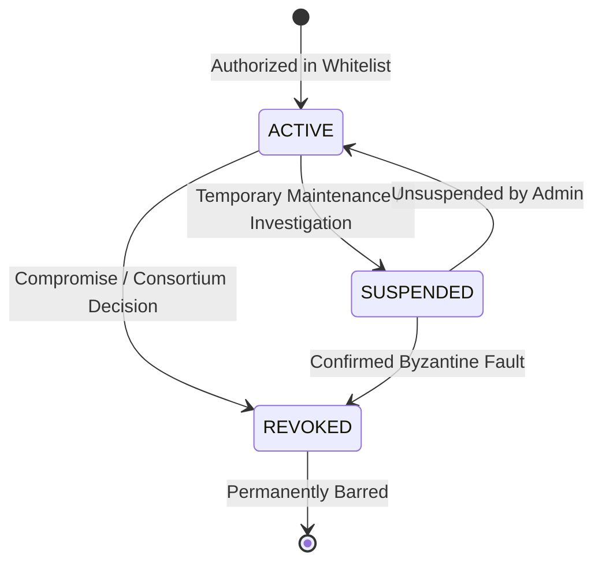

# PDSChain Phase 12: Peer Revocation, Suspension & CRL Specification

## 1. Overview

`PeerAuthorizationRegistry` governs validator node authorization, temporary operational suspensions, and permanent security revocations across the PDSChain consortium.

---

## 2. Peer Lifecycle States



- **ACTIVE**: Normal validator node. Permitted to establish mTLS transport, exchange consensus envelopes, propose blocks, and participate in voting.
- **SUSPENDED**: Temporarily barred node (e.g. maintenance, degraded sync, suspected misbehavior). Transport handshakes and incoming envelopes are rejected with `UNAUTHORIZED_PEER`. Node can be restored to `ACTIVE` via `unsuspendPeer()`.
- **REVOKED**: Permanently expelled node (e.g. confirmed Byzantine double-voting, key compromise). Transport connections are terminated immediately and rejected with `REVOKED_PEER`.

---

## 3. Certificate Revocation List (CRL) by Fingerprint

In addition to node IDs, `PeerAuthorizationRegistry` maintains a SHA-256 fingerprint blacklist:
1. When a transport private key is compromised or retired, its certificate fingerprint is revoked:
   ```javascript
   registry.revokeCertificate(fingerprint, 'Private key retired');
   ```
2. Any peer presenting this certificate during the TLS handshake is rejected with `REVOKED_CERTIFICATE` before application data is accepted.

---

## 4. API Endpoints

- `GET /health/keys` — Exposes authorized peers count, active count, suspended count, revoked count, and CRL count.
- `POST /admin/peers/revoke` — Revokes a validator ID or certificate fingerprint.

