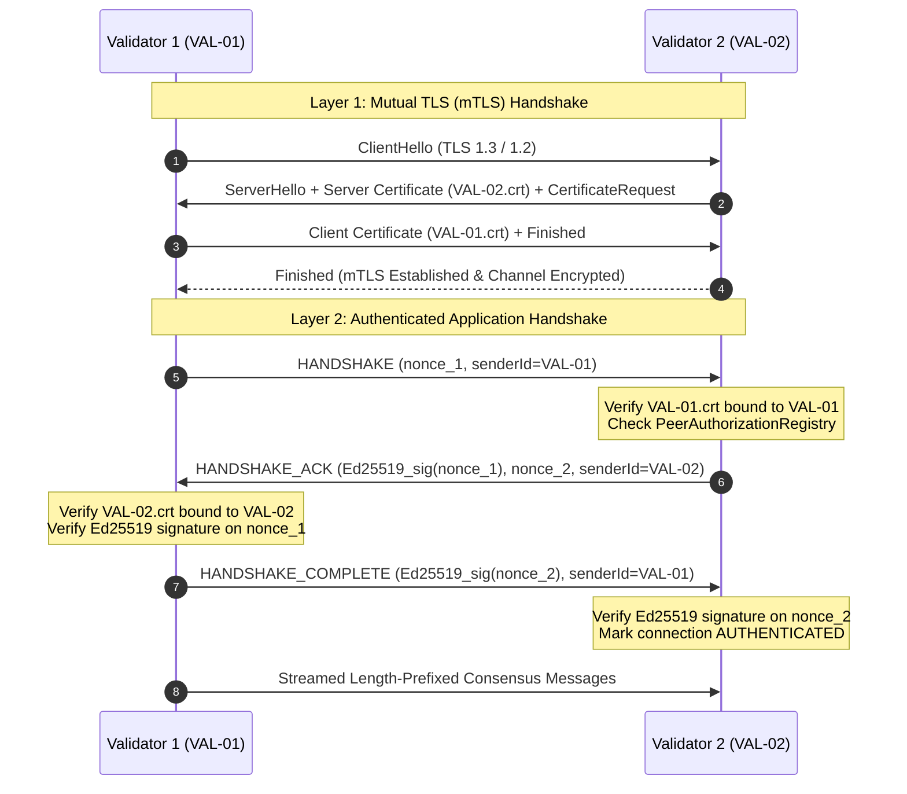

# PDSChain Phase 12: TLS/mTLS & Dual-Layer Transport Security Architecture

## 1. Executive Summary

Phase 12 introduces comprehensive **Transport Layer Security (TLS 1.2 / TLS 1.3)** and **Mutual TLS (mTLS)** for PDSChain's validator-to-validator peer network. It reinforces the consensus and ledger replication network with defense-in-depth:
1. **Network Layer Privacy & Integrity**: All wire communication between validator daemons is encrypted using strong cipher suites, eliminating plaintext eavesdropping and man-in-the-middle tampering.
2. **Dual-Layer Authentication**: Mutual X.509 transport authentication is cryptographically coupled with application-level Ed25519 challenge-response signatures.
3. **Strict Identity Binding**: Transport certificates are bound directly to validator identifiers. Impersonation attacks where a node presents a valid certificate for one node but attempts to participate as another are rejected immediately with `VALIDATOR_IDENTITY_MISMATCH`.
4. **Key Lifecycle Separation**: Consensus keys (Ed25519) and transport keys (X.509 RSA/ECDSA) maintain independent operational and rotation lifecycles.

---

## 2. Dual-Layer Authentication Flow

PDSChain does not replace or weaken Ed25519 consensus signatures with TLS. Instead, TLS provides encrypted transport while Ed25519 provides non-repudiable blockchain consensus finality.



---

## 3. Cryptographic Identity Binding Invariant

To defeat MITM relay and spoofing attacks, PDSChain establishes a strict invariant in `HandshakeHandler`:

$$\text{SAN}(\text{cert}) \cap \{\text{Claimed ValidatorId}\} \neq \emptyset \quad \lor \quad \text{CN}(\text{cert}) = \text{Claimed ValidatorId}$$

If a connecting peer presents a certificate issued for `VAL-02` but sends a `HANDSHAKE` payload with `senderId = VAL-01`, the connection is immediately aborted:
```json
{
  "name": "NetworkError",
  "code": "VALIDATOR_IDENTITY_MISMATCH",
  "message": "Transport certificate CN 'VAL-02' does not match claimed Ed25519 identity 'VAL-01'"
}
```

---

## 4. Threat Model & Mitigation Matrix

| Threat / Attack Vector | Mitigation in Phase 12 | Status |
| :--- | :--- | :--- |
| **Plaintext Eavesdropping** | All TCP connections mandate TLS 1.2 / TLS 1.3 encryption. | Verified |
| **Eavesdropper Injection / MITM** | Mutual authentication requires valid client certificate signed by Consortium CA. | Verified |
| **Impersonation / Spoofing** | Strict CN/SAN binding rejects mismatch between cert identity and Ed25519 sender ID. | Verified |
| **Alien / Rogue CA** | Pinned Consortium CA trust store rejects certificates from unapproved issuers (`UNKNOWN_ISSUER`). | Verified |
| **Expired Credentials** | Multi-tier proactive expiration monitoring (30d, 14d, 7d, 24h) and handshake rejection (`EXPIRED_CERTIFICATE`). | Verified |
| **Revoked / Compromised Nodes** | `PeerAuthorizationRegistry` enforces instant peer revocation (`REVOKED_PEER`) and CRL fingerprint rejection. | Verified |
| **Plaintext Downgrade** | Insecure plaintext TCP connections to mTLS port are aborted by TLS handshake filter. | Verified |
| **Private Key Extraction** | Strict in-memory redaction prevents key disclosure across APIs, logs, metrics, or error dumps. | Verified |

