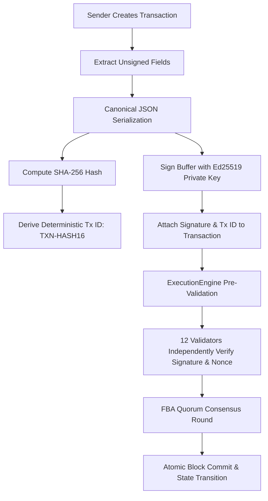

# Phase 2 Summary — PDSChain Cryptographic Identity & Signed Transactions

## Executive Summary

Phase 2 introduces asymmetric digital cryptographic identities and end-to-end digitally signed transactions to PDSChain. Every transaction proposal in the network is now signed by its sender using high-security **Ed25519** elliptic-curve cryptography, serialized canonically in a property-order-agnostic format, uniquely identified by a deterministic transaction ID (`TXN-<HASH16>`), protected by sequential nonces against replay attacks, and independently verified by institutional validators before participating in **Federated Byzantine Agreement (FBA)** consensus.

All **79/79 tests pass** across 8 test suites with **100% backward API compatibility**.

---

## 1. Cryptographic Identity Model & Key Management

### A. Asymmetric Cryptography: Ed25519
- **Algorithm Selected**: Standard native **Ed25519** (Edwards-curve Digital Signature Algorithm).
- **Rationale**:
  - Constant-time native execution in Node.js `crypto` with zero external dependencies.
  - High performance (thousands of signatures and verifications per second).
  - Immunity to side-channel timing attacks.
  - Compact 32-byte public keys and deterministic 64-byte signatures.
- **Key Structure**:
  - `publicKey`: SPKI DER hex encoded public key.
  - `privateKey`: PKCS#8 PEM string (Internal only; strictly protected).

### B. Address Derivation Scheme
- **Address Format**: `PDS1` + 40-character lowercase hex string.
  $$\text{Address} = \text{"PDS1"} + \text{SHA-256}(\text{"PDSCHAIN\_ADDR:"} + \text{publicKeyHex})[0..40]$$
- **Properties**: Deterministic, collision-resistant, and unambiguous.

---

## 2. Canonical Serialization & Deterministic Transaction IDs

### A. Property-Order-Agnostic Canonical Serialization
[`backend/src/blockchain/serialization.js`](file:///d:/Blockchain%20Project/BlockChain---Project/backend/src/blockchain/serialization.js) recursively sorts object keys lexicographically prior to serialization.
- Guarantee: Regardless of the order properties are defined in JavaScript, the serialization output is identical.

### B. Unsigned Fields Extraction
To ensure the digital signature never signs itself, the signing function operates exclusively on the unsigned canonical fields:
$$\text{Unsigned Fields} = \{\text{version}, \text{type}, \text{sender}, \text{receiver}, \text{payload}, \text{timestamp}, \text{nonce}, \text{senderPublicKey}\}$$

### C. Deterministic Transaction ID
The transaction ID is derived directly from the SHA-256 hash of the canonical unsigned transaction string:
$$\text{TransactionID} = \text{"TXN-"} + \text{SHA-256}(\text{CanonicalUnsignedStr})[0..16]\text{.toUpperCase()}$$

---

## 3. Signing and Verification Flow



### Verification Checks:
1. `signature` exists and is non-empty hex.
2. `senderPublicKey` is valid Ed25519 key.
3. If sender begins with `PDS1`, verifies `deriveAddress(senderPublicKey) === sender`.
4. Re-computes unsigned canonical string and verifies `crypto.verify(null, canonicalBuffer, publicKey, signatureBuffer)`.
5. Verifies `transaction.transactionId === TXN-<canonicalHash[0..16]>`.

---

## 4. Nonce Sequencing & Replay Protection

### A. Sender-Specific Nonce
- Each sender address tracks a strictly sequential integer counter `nonce`.
- Expected nonce begins at `0` for the sender's first transaction.
- Each mined transaction increments the sender's expected nonce:
  $$\text{Expected Nonce}_{n+1} = \text{Expected Nonce}_n + 1$$

### B. Replay & Duplicate Rejection
- If `nonce < expectedNonce`: Rejected with `REPLAYED_NONCE`.
- If `nonce > expectedNonce`: Rejected with `NONCE_GAP`.
- If `transactionId` was previously processed: Rejected with `DUPLICATE_TRANSACTION`.

---

## 5. Validator Independent Verification

Every institutional validator node in [`ValidatorNode.js`](file:///d:/Blockchain%20Project/BlockChain---Project/backend/src/consensus/ValidatorNode.js) and [`validatorServer.js`](file:///d:/Blockchain%20Project/BlockChain---Project/backend/src/validators/validatorServer.js) independently executes cryptographic signature verification on incoming candidate proposals. If a signature has been tampered with or contains an invalid nonce, the validator votes `REJECT` with reason `INVALID_TRANSACTION_SIGNATURE`.

---

## 6. Security Considerations

- **Private Key Isolation**: Private keys are never logged, never returned by API endpoints, never stored in blocks, and never transmitted over the network.
- **Payload Immutability**: Any modification to commodity, quantity, citizen name, or sender in transit immediately invalidates the Ed25519 signature.

---

## 7. API Additions

1. `GET /api/blockchain/identity/:idOrAddress`: Returns safe public participant metadata (`address`, `publicKey`, `entityId`, `entityType`, `nextNonce`).
2. `POST /api/blockchain/transactions/verify`: Public verification endpoint that verifies digital signatures and deterministic IDs without executing state transitions.

---

## 8. Test Verification Results

```
Test Suites: 8 passed, 8 total
Tests:       79 passed, 79 total
Snapshots:   0 total
Time:        10.401 s
```

### Breakdown by Suite:
1. `tests/cryptography.test.js`: 25/25 passed (Keygen, address derivation, signing, tampering detection, nonces, replays, validator verification, key privacy)
2. `tests/auth.test.js`: 14/14 passed (Authentication & RBAC)
3. `tests/api.test.js`: 13/13 passed (REST API endpoints & Dashboards)
4. `tests/transaction.test.js`: 5/5 passed (PDS Distribution & Business Logic)
5. `tests/execution.test.js`: 9/9 passed (ExecutionEngine, StateManager, Transaction, Merkle Module)
6. `tests/consensus.test.js`: 5/5 passed (12-Validator FBA Quorum & Fault Tolerance)
7. `tests/warehouse.test.js`: 3/3 passed (Warehouse Logistics & Stock Transfers)
8. `tests/blockchain.test.js`: 5/5 passed (Ledger, Genesis, Merkle Root, Tamper Detection)

---

## 9. Known Remaining Limitations

1. **Transaction Mempool**: Transactions are proposed and mined per operation; asynchronous mempool batching is reserved for Phase 3.
2. **State Root Trie**: State is stored in SQLite; cryptographic state roots are not yet committed into block headers.
3. **P2P Transport**: Validator communication runs over local HTTP endpoints with fallback to in-process evaluation.

---

## 10. Recommended Phase 3 Scope

1. **Transaction Mempool**: In-memory transaction queue with nonce sorting, prioritization, and validation pool.
2. **Block Packing**: Batching multiple pending transactions from the mempool into candidate blocks.
3. **Signed Validator Votes & Consensus Certificates**: Attaching cryptographic validator signatures to candidate blocks.
4. **State Root Merkle Trie**: Computing and anchoring state root hashes into block headers.

