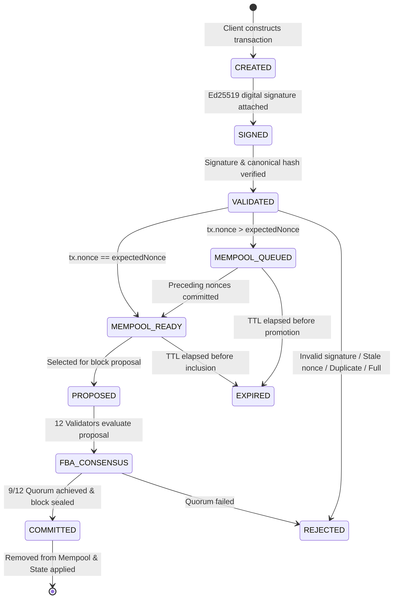

# Phase 3 Summary — PDSChain Transaction Mempool

## Executive Summary

Phase 3 introduces a dedicated, high-performance, in-memory **Transaction Mempool** (staging area) for PDSChain. The mempool sits cleanly between the transaction cryptographic validation layer (established in Phase 2) and the block proposal / consensus engine (12-validator Federated Byzantine Agreement).

Incoming signed transactions are canonically verified, sequence-checked against sender nonces, protected against replay and conflict attacks, and staged in the mempool with structured lifecycle states (`READY` or `QUEUED`). Block proposers deterministically select candidate transactions from the `READY` pool, submit them to the 12 institutional FBA validators for consensus, commit them to the blockchain ledger, and atomically remove them from the active mempool upon block finalization.

All **117/117 tests pass** across 9 test suites with **100% backward API compatibility**.

---

## 1. Architectural Role of the Mempool

```
                               PDSChain Layered Pipeline
                               
    ┌───────────────────────────┐
    │      PDS APPLICATION      │  ──► Beneficiaries, Fair Price Shops, Warehouses
    └─────────────┬─────────────┘
                  │
                  ▼
    ┌───────────────────────────┐
    │  TRANSACTION CONSTRUCTOR  │  ──► Builds normalized PDS distribution transactions
    └─────────────┬─────────────┘
                  │
                  ▼
    ┌───────────────────────────┐
    │   CRYPTOGRAPHIC SIGNING   │  ──► Canonically serialized + Ed25519 digital signature
    └─────────────┬─────────────┘
                  │
                  ▼
    ┌───────────────────────────┐
    │   TRANSACTION VALIDATOR   │  ──► Structure Check, Byte Size Check, Signature Verification
    └─────────────┬─────────────┘
                  │
                  ▼
    ┌───────────────────────────┐
    │     MEMPOOL (STAGING)     │  ──► Staged in memory (READY / QUEUED)
    │  • O(1) Lookups           │  ──► Nonce Sequencing & Gap Enforcement
    │  • Duplicate Prevention   │  ──► TTL Expiration & Capacity Limits
    │  • Deterministic Queue    │  ──► Observability Metrics
    └─────────────┬─────────────┘
                  │
                  ▼
    ┌───────────────────────────┐
    │   BLOCK PROPOSAL INPUT    │  ──► getCandidateTransactions(limit) [Deterministic Order]
    └─────────────┬─────────────┘
                  │
                  ▼
    ┌───────────────────────────┐
    │   12-VALIDATOR FBA CORE   │  ──► Federated Byzantine Agreement (3-of-4 slices, 9/12)
    └─────────────┬─────────────┘
                  │
                  ▼
    ┌───────────────────────────┐
    │     BLOCKCHAIN COMMIT     │  ──► addBlock([txs]) & removeIncludedTransactions([txIds])
    └─────────────┬─────────────┘
                  │
                  ▼
    ┌───────────────────────────┐
    │     STATE TRANSITION      │  ──► ExecutionEngine state deduction & nonce consumption
    └───────────────────────────┘
```

---

## 2. Transaction Lifecycle



### Lifecycle Status Definitions:
- **`READY`**: Transaction has valid signature and its nonce precisely matches the sender's current expected nonce. Eligible for block candidate selection.
- **`QUEUED`**: Transaction has valid signature but a future nonce (`nonce > expectedNonce`). Held safely in memory and promoted to `READY` once preceding nonces are committed.
- **`INCLUDED`**: Transaction has been successfully sealed into a committed blockchain block and removed from the active staging pool.
- **`EXPIRED`**: Transaction exceeded its configured TTL (`expiresAt <= now`) and is pruned by cleanup routines.
- **`REJECTED`**: Transaction failed admission due to invalid signature, size overflow, capacity exhaustion, or duplicate submission.

---

## 3. Admission Pipeline & Policy Enforcement

Incoming transactions entering the mempool undergo an 8-stage verification pipeline:

1. **Basic Structure & Field Validation**: Verifies object integrity, `sender`, `receiver`, and `type`.
2. **Canonical Size Limit**: Serializes the unsigned transaction canonically and enforces `sizeBytes <= maxTransactionSizeBytes` (default: 64 KB).
3. **Cryptographic Signature Verification**: Re-verifies Ed25519 digital signature over canonical unsigned fields using [`verifyTransactionSignature`](file:///d:/Blockchain%20Project/BlockChain---Project/backend/src/blockchain/identity/signature.js).
4. **Deterministic Transaction ID Validation**: Guarantees `transactionId` matches `TXN-<HASH16>` derived from the canonical SHA-256 hash.
5. **Duplicate & Replay Protection**:
   - Rejects if `transactionId` is already staged in the active mempool (`DUPLICATE_TRANSACTION`).
   - Rejects if `transactionId` was already committed to the ledger via `StateManager.isTransactionIdSeen()` (`DUPLICATE_TRANSACTION`).
6. **Conflicting Nonce Protection**:
   - Rejects if another pending transaction from the same sender exists with the identical nonce (`CONFLICTING_NONCE`).
7. **Nonce Sequencing & Nonce Gap Policy**:
   - `nonce < expectedNonce`: Rejected as stale (`REPLAYED_NONCE`).
   - `nonce == expectedNonce`: Admitted as `READY`.
   - `expectedNonce < nonce <= expectedNonce + maxFutureNonceGap`: Admitted as `QUEUED`.
   - `nonce > expectedNonce + maxFutureNonceGap`: Rejected with `NONCE_GAP`.
8. **Capacity & Sender Limits**:
   - Enforces total mempool capacity (`maxTransactions`, default: 5,000).
   - Enforces per-sender pending quota (`maxTransactionsPerSender`, default: 100).

---

## 4. Deterministic Candidate Selection

Block proposers retrieve candidate transactions via `getCandidateTransactions(limit)`. To guarantee consensus reproducibility across distributed nodes, selection is strictly deterministic:

1. **Prunes Expired Transactions**: Runs automatic TTL cleanup.
2. **Filters for `READY` Status Only**: `QUEUED` transactions are never proposed until promoted.
3. **Deterministic Multi-Tier Sort**:
   - Primary: `sender` address ascending (lexicographical string comparison).
   - Secondary: `nonce` ascending (numerical integer comparison).
   - Tie-Breaker: `transactionId` ascending (lexicographical string comparison).
4. **Applies Limit**: Truncates candidate batch to the requested proposal limit.

---

## 5. Nonce Promotion & Block Inclusion

When a block is committed to the blockchain ledger:
1. `removeIncludedTransactions([txIds], blockNumber)` marks entries as `INCLUDED` and unindexes them from `entries`, `bySender`, and `bySenderNonce`.
2. `promoteQueuedTransactions(sender)` inspects all queued items for affected senders. Any queued transaction with `nonce === newlyExpectedNonce` is promoted to `READY` status (along with any consecutive nonces in the chain).

---

## 6. Persistence Decision & Restart Characteristics

- **In-Memory Staging**: In Phase 3, the mempool maintains in-memory indexing (`Map<transactionId, MempoolEntry>`, `Map<sender, Set<txId>>`, `Map<sender, Map<nonce, txId>>`).
- **Crash / Restart Behavior**:
  - Unconfirmed in-memory pending transactions may be dropped upon process termination.
  - Committed blockchain blocks and state in the database remain authoritative.
  - Senders may safely resubmit unconfirmed transactions.
  - Replay protection guarantees already-committed transactions cannot be executed again.
- **Future Persistence Strategy (Production Phase)**:
  - In a full distributed production cluster, mempool staging will be backed by durable write-ahead logs or distributed message queues (e.g. Redis / Kafka / PostgreSQL transaction staging tables) with crash-recovery reconciliation.

---

## 7. Security & Key Privacy

- **Zero Private Key Exposure**: Private keys are strictly isolated in memory keystores and never stored in `MempoolEntry`, never logged, and never returned in API responses.
- **Tamper Resistance**: Modifying any field (quantity, commodity, sender, receiver, nonce, timestamp) invalidates the Ed25519 signature and causes immediate admission rejection.
- **DoS Protection**: Bounded pool capacities, per-sender quotas, size limits, and TTL prevent memory exhaustion attacks.

---

## 8. Public REST API Endpoints

| Method | Endpoint | Description |
| :--- | :--- | :--- |
| `GET` | `/api/blockchain/mempool` | Returns active pending transactions (optionally filtered by `?status=READY` or `?status=QUEUED`). |
| `GET` | `/api/blockchain/mempool/stats` | Returns real-time metrics (`total`, `ready`, `queued`, `expired`, `accepted`, `rejected`, `duplicate`, `nonceConflicts`, `capacity`, `utilization`). |
| `GET` | `/api/blockchain/mempool/:transactionId` | Returns public details for a single pending mempool transaction. |

---

## 9. Verification & Test Suite Results

The comprehensive test suite was executed via Jest in sequential in-band mode:

```bash
PASS tests/auth.test.js (14 tests)
PASS tests/api.test.js (13 tests)
PASS tests/warehouse.test.js (3 tests)
PASS tests/cryptography.test.js (25 tests)
PASS tests/transaction.test.js (5 tests)
PASS tests/mempool.test.js (38 tests)
PASS tests/execution.test.js (9 tests)
PASS tests/consensus.test.js (5 tests)
PASS tests/blockchain.test.js (5 tests)

Test Suites: 9 passed, 9 total
Tests:       117 passed, 117 total
Snapshots:   0 total
Time:        6.309 s
```

### Mempool Test Coverage Summary (38 Tests):
- `[PASS]` Valid signed transaction admission into `READY` status.
- `[PASS]` Rejection of null, malformed, or unsigned transactions.
- `[PASS]` Rejection of tampered payloads and corrupted signature bytes.
- `[PASS]` Rejection of invalid or mismatched deterministic transaction IDs.
- `[PASS]` Rejection of duplicate transaction IDs and previously committed transactions.
- `[PASS]` Rejection of conflicting same-sender + same-nonce transactions.
- `[PASS]` Expected nonce sequencing and stale nonce rejection (`REPLAYED_NONCE`).
- `[PASS]` Future nonce admission as `QUEUED` and promotion to `READY` upon prior nonce commit.
- `[PASS]` Nonce gap limit enforcement (`NONCE_GAP`).
- `[PASS]` Global capacity limit (`MEMPOOL_FULL`) and per-sender quota (`SENDER_LIMIT_EXCEEDED`).
- `[PASS]` Serialized byte size constraint enforcement (`TRANSACTION_TOO_LARGE`).
- `[PASS]` TTL timestamp computation, `cleanupExpired()`, and candidate selection filtering.
- `[PASS]` Deterministic candidate selection (READY only, sender alphabetical, nonce ascending, txId tie-breaker).
- `[PASS]` Block inclusion removal and unindexing.
- `[PASS]` Private key isolation across mempool entries, summaries, and API responses.
- `[PASS]` Resilience on empty mempools and idempotent repeated removals.
- `[PASS]` Full end-to-end integration: Identity -> Sign -> Pre-validate -> Mempool -> FBA Consensus -> Block Commit -> Mempool Removal -> State Transition.

