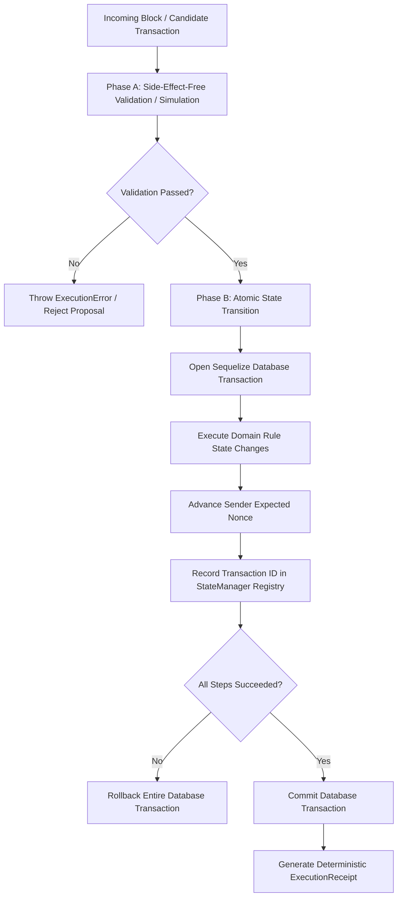

# Phase 4: Deterministic Execution & Smart-Contract-Like Rule Engine

## Overview

In **Phase 4**, PDSChain introduces a **deterministic, smart-contract-like execution layer** for Public Distribution System operations. PDSChain implements modular domain transition logic directly within application-specific execution modules rather than relying on an external VM (such as the EVM) or custom bytecode.

> [!IMPORTANT]
> **PDSChain is an application-specific, permissioned blockchain. It does NOT use Ethereum, EVM, Solidity bytecode, cryptocurrency tokens, or gas fees. State transitions are governed by modular, deterministic JavaScript execution rules running on top of atomic database transactions with deterministic execution receipts.**

---

## 1. Architectural Architecture & Layer Separation

```
PDSChain Execution Architecture
│
├── 1. Execution Boundary (`backend/src/execution/`)
│   ├── `ExecutionEngine.js`
│   │   ├── Validates proposal signatures, nonce ordering, and idempotency
│   │   ├── Dispatches transactions to registered domain rules
│   │   └── Coordinates atomic 2-phase execution inside database transactions
│   │
│   ├── `StateManager.js`
│   │   ├── Deterministic world state queries and mutations
│   │   ├── Replay protection: per-sender nonce sequencing (`consumedNonces`)
│   │   └── Idempotency registry: committed transaction IDs (`seenTransactionIds`)
│   │
│   ├── `ExecutionContext.js`
│   │   ├── Clean context isolating transaction and block parameters
│   │   └── Eliminates non-deterministic inputs (no unseeded randomness, system time, or network calls)
│   │
│   ├── `ExecutionReceipt.js`
│   │   ├── Verifiable, structured execution receipt
│   │   └── Deterministically sorted state changes (`entity ASC, id ASC, field ASC`)
│   │
│   └── `errors/ExecutionErrors.js`
│       ├── Standardized structured error codes
│       └── `ExecutionError` class with detailed machine-readable diagnostic payloads
│
└── 2. Smart-Contract-Like Domain Rules (`backend/src/execution/rules/`)
    ├── `BaseRule.js` (Abstract rule contract: `validate`, `execute`)
    ├── `AuthorizationRule.js` (Deterministic actor permission verification)
    ├── `EntitlementRule.js` (Citizen eligibility, quota allowance, quota deductions)
    ├── `InventoryRule.js` (Fair Price Shop stock availability and deductions)
    ├── `DistributionRule.js` (Atomic composite grain distribution combining quota and stock)
    ├── `WarehouseTransferRule.js` (Atomic warehouse-to-shop/warehouse logistics transfers)
    └── `index.js` (Rule registry mapping transaction types to rule singletons)
```

---

## 2. Smart-Contract-Like Domain Rule Modules

| Rule Module | Transaction Types | Responsibilities | Error Codes |
| :--- | :--- | :--- | :--- |
| **`AuthorizationRule`** | All | Enforces sender role requirements (SHOP, CITIZEN, ADMIN, WAREHOUSE) | `UNAUTHORIZED_SENDER`, `INVALID_TRANSACTION_TYPE` |
| **`EntitlementRule`** | `ENTITLEMENT`, `DEDUCT_QUOTA` | Validates beneficiary active status, monthly quota limit, and remaining entitlement | `BENEFICIARY_NOT_FOUND`, `BENEFICIARY_INELIGIBLE`, `COMMODITY_NOT_FOUND`, `INVALID_QUANTITY`, `INSUFFICIENT_ENTITLEMENT` |
| **`InventoryRule`** | `INVENTORY`, `SHOP_STOCK_DEDUCTION` | Verifies Fair Price Shop stock availability and prevents negative stock balances | `SHOP_NOT_FOUND`, `COMMODITY_NOT_FOUND`, `INVALID_QUANTITY`, `INSUFFICIENT_STOCK` |
| **`DistributionRule`** | `DISTRIBUTION` | Atomic composite rule validating beneficiary quota and shop stock in a single step | `BENEFICIARY_NOT_FOUND`, `BENEFICIARY_INELIGIBLE`, `SHOP_NOT_FOUND`, `INSUFFICIENT_ENTITLEMENT`, `INSUFFICIENT_STOCK`, `INVALID_QUANTITY` |
| **`WarehouseTransferRule`** | `WAREHOUSE_TRANSFER`, `TRANSFER` | Validates warehouse inventory, decrements source warehouse stock, increments destination stock, and logs `StockTransfer` | `WAREHOUSE_NOT_FOUND`, `SHOP_NOT_FOUND`, `COMMODITY_NOT_FOUND`, `INVALID_QUANTITY`, `INSUFFICIENT_STOCK` |

---

## 3. Two-Phase Execution Model

Execution in PDSChain follows a strict two-phase lifecycle:



### Phase A: Simulation & Pre-Validation (`validateTransaction`)
- Pure read-only checks against state.
- Computes `predictedChanges` (before, after, delta, unit).
- Guarantees **zero database mutation** and **zero nonce consumption** on validation.

### Phase B: Atomic Execution (`executeTransaction`)
- Runs within an explicit database lock/transaction.
- Mutates target models (Beneficiary quota, Inventory stock, StockTransfer records).
- Advances the sender's consumed nonce and records the transaction ID in the idempotency registry.
- If any stage fails, the entire database transaction is rolled back, leaving zero partial state mutations.

---

## 4. Deterministic Execution Receipts (`ExecutionReceipt`)

Every executed transaction produces a structured `ExecutionReceipt`. The receipt provides an audit trail with deterministically ordered state modifications:

```json
{
  "receiptNumber": "REC-72A1B8C904FE",
  "transactionId": "TXN-72A1B8C904FE",
  "status": "SUCCESS",
  "transactionType": "DISTRIBUTION",
  "blockNumber": 42,
  "blockHash": "0x9999999999999999",
  "consensusRound": "RND-42",
  "timestamp": "2026-03-31T12:00:00.000Z",
  "verificationStatus": "CRYPTOGRAPHICALLY_VERIFIED_ON_CHAIN",
  "stateChanges": [
    {
      "entity": "beneficiary",
      "id": "BEN-001",
      "field": "currentMonthClaimed.Rice",
      "before": 0,
      "after": 5,
      "delta": 5,
      "unit": "KG"
    },
    {
      "entity": "shop",
      "id": "FPS-002",
      "field": "stock.Rice",
      "before": 1000,
      "after": 995,
      "delta": -5,
      "unit": "KG"
    }
  ]
}
```

### Deterministic Sorting of State Changes
To ensure that receipts computed by different validator nodes have identical JSON serialization:
1. `stateChanges` are sorted by `entity` ASC (`beneficiary` before `shop` before `warehouse`).
2. Secondary sort by `id` ASC.
3. Tertiary sort by `field` ASC.

---

## 5. Standardized Error Codes (`ExecutionErrors.js`)

| Error Code | HTTP Status | Description |
| :--- | :---: | :--- |
| `INVALID_TRANSACTION_TYPE` | 400 | Transaction type is unrecognized or unsupported |
| `UNAUTHORIZED_SENDER` | 403 | Transaction sender role is unauthorized for operation |
| `BENEFICIARY_NOT_FOUND` | 404 | Beneficiary ID does not exist in state |
| `BENEFICIARY_INELIGIBLE` | 400 | Beneficiary is suspended or marked ineligible |
| `SHOP_NOT_FOUND` | 404 | Fair Price Shop ID does not exist in state |
| `WAREHOUSE_NOT_FOUND` | 404 | Warehouse ID does not exist in state |
| `COMMODITY_NOT_FOUND` | 404 | Commodity not registered or missing from request |
| `INSUFFICIENT_ENTITLEMENT`| 400 | Requested quantity exceeds remaining monthly quota |
| `INSUFFICIENT_STOCK` | 400 | Requested quantity exceeds available shop/warehouse stock |
| `INVALID_QUANTITY` | 400 | Quantity is zero, negative, or not a finite number |
| `ALREADY_APPLIED` | 409 | Transaction ID was already executed and committed |
| `REPLAYED_NONCE` | 400 | Transaction nonce has already been consumed |
| `INVALID_SIGNATURE` | 401 | Ed25519 digital signature validation failed |
| `EXECUTION_FAILED` | 500 | Unhandled execution exception |

---

## 6. Verification and Regression Testing

The Phase 4 test suite (`backend/tests/execution-rules.test.js`) contains 48 automated tests covering:
- Deterministic quota deductions and negative quota prevention.
- Single-pass composite validation for grain distribution.
- Warehouse logistics stock transfers and audit log generation.
- Role-based authorization rules.
- Multi-entity atomicity and rollback verification under simulated failures.
- Multi-run determinism verification (identical outputs for identical inputs).
- Full end-to-end integration: `Tx -> Mempool -> Simulation -> FBA Consensus -> Block Commit -> Execution -> Receipt`.

### Test Suite Results
```
PASS tests/execution-rules.test.js (48 passed, 48 total)
PASS tests/mempool.test.js (37 passed, 37 total)
PASS tests/cryptography.test.js (23 passed, 23 total)
PASS tests/consensus.test.js (5 passed, 5 total)
PASS tests/blockchain.test.js (5 passed, 5 total)
PASS tests/transaction.test.js (5 passed, 5 total)
PASS tests/warehouse.test.js (3 passed, 3 total)
PASS tests/execution.test.js (7 passed, 7 total)
PASS tests/auth.test.js (15 passed, 15 total)
PASS tests/api.test.js (17 passed, 17 total)

Test Suites: 10 passed, 10 total
Tests:       165 passed, 165 total
```

