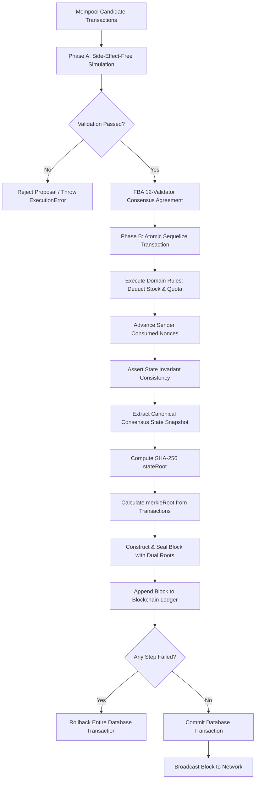

# Phase 5: Deterministic State Transition & State Root

## Overview

In **Phase 5**, PDSChain introduces a **deterministic state transition model** and **cryptographic state root calculation** (`stateRoot`) anchored directly into every sealed block header.

This establishes a formal dual-commitment model for PDSChain:
1. **Transaction Commitment (`merkleRoot`)**: Cryptographically verifies which transactions were included in the block.
2. **State Commitment (`stateRoot`)**: Cryptographically commits to the exact post-execution world state of the entire Public Distribution System after applying the block's transactions.

> [!IMPORTANT]
> **PDSChain uses a pure SHA-256 deterministic canonical state serialization model (`STATE_ROOT_VERSION = 1`). It does NOT implement an Ethereum Merkle Patricia Trie (MPT), EVM bytecode, Solidity storage slots, gas, or public network mechanics. Consensus remains governed by 12-validator Federated Byzantine Agreement (FBA).**

---

## 1. Dual Commitment Model in Block Headers

Every block header in PDSChain binds both transaction history and execution state outcome into its immutable hash:

```
┌────────────────────────────────────────────────────────────────────────┐
│                              BLOCK HEADER                              │
├────────────────────────────────────────────────────────────────────────┤
│  blockNumber: 42                                                       │
│  previousHash: 0x8a7f...                                               │
│  timestamp: 1711886400000                                              │
│  merkleRoot: e3b0c44298fc1c149afbf4c8996fb92427ae41e4649b934ca495991b7852b855 │  <- Transaction Commitment
│  stateRoot:  9f86d081884c7d659a2feaa0c55ad015a3bf4f1b2b0b822cd15d6c15b0f00a08 │  <- State Commitment
│  nonce: 0                                                              │
│  consensusStatus: "COMMITTED"                                          │
└────────────────────────────────────────────────────────────────────────┘
                                    │
                                    ▼
       SHA-256 Block Hash: `hashBlockHeader(headerPayload)`
```

If even a single byte of state is altered (e.g. modifying 1 KG of grain inventory or tampering with a beneficiary's claimed quota), the calculated `stateRoot` diverges, invalidating the block hash and triggering independent rejection across all 12 institutional validator nodes.

---

## 2. Canonical Consensus State Model

Consensus-relevant state contains only deterministic Public Distribution System entities required to verify entitlements, allocations, and custody. Operational metadata that is non-deterministic or security-sensitive is strictly excluded.

### Consensus-Relevant Entities

```
Canonical State Snapshot
├── beneficiaries: Array<Beneficiary>
│   └── { id, name, rationCardNumber, category, monthlyQuota, currentMonthClaimed, status }
├── shops: Array<Shop>
│   └── { id, name, shopNumber, location, status }
├── warehouses: Array<Warehouse>
│   └── { id, name, warehouseCode, location, capacity, currentStock, status }
├── shopInventory: Array<ShopInventory>
│   └── { shopId, commodity, quantity, unit }
└── warehouseInventory: Array<WarehouseInventory>
    └── { warehouseId, commodity, quantity, unit }
```

### Excluded Operational Data
The following are excluded from state root calculation:
- User authentication records, passwords, bcrypt hashes, JWT tokens.
- Ephemeral session state, connection logs, timestamps during hashing.
- Internal database auto-increment row IDs (`id` sequence numbers).

---

## 3. Deterministic State Serialization & Ordering

To ensure that every validator computes an identical SHA-256 hash regardless of database query ordering or JavaScript engine property layout, state serialization follows strict canonical rules:

1. **Deterministic Array Sorting**:
   - `beneficiaries`: Sorted ascending by `id` (`a.id.localeCompare(b.id)`).
   - `shops`: Sorted ascending by `id` (`a.id.localeCompare(b.id)`).
   - `warehouses`: Sorted ascending by `id` (`a.id.localeCompare(b.id)`).
   - `shopInventory`: Sorted ascending by `shopId`, then by `commodity` name.
   - `warehouseInventory`: Sorted ascending by `warehouseId`, then by `commodity` name.
2. **Deterministic Object Key Ordering**:
   - `canonicalStringify(obj)` recursively sorts all object keys in lexicographical order.
   - Handles nested objects, arrays, and primitive numbers/strings uniformly.
3. **Version Tagging**:
   - Serialization envelope encapsulates state under `STATE_ROOT_VERSION = 1`:
   ```json
   {
     "version": 1,
     "state": {
       "beneficiaries": [...],
       "shops": [...],
       "warehouses": [...],
       "shopInventory": [...],
       "warehouseInventory": [...]
     }
   }
   ```

---

## 4. State Root Calculation Algorithm

The state root is calculated using pure standard SHA-256:

```javascript
// backend/src/blockchain/state/stateSerializer.js
function calculateStateRoot(state) {
  const canonicalState = canonicalizeState(state);
  const versionedEnvelope = {
    version: STATE_ROOT_VERSION, // 1
    state: canonicalState,
  };
  const canonicalString = canonicalStringify(versionedEnvelope);
  return crypto.createHash('sha256').update(canonicalString, 'utf8').digest('hex');
}
```

### Properties:
- **Length**: Exactly 64 hexadecimal characters (lowercase).
- **Determinism**: 100% reproducible across machines, OS platforms, and database instances.
- **Sensitivity**: Modifying any field (quantity, status, quota) changes the resulting hash completely.

---

## 5. Two-Phase State Transition Execution

State transitions in PDSChain execute inside atomic database transactions:



### Rollback Guarantees
If any failure occurs during execution, state root calculation, or block persistence:
- The entire Sequelize transaction is rolled back.
- Stock allocations, citizen claimed amounts, and sender nonces revert to their exact pre-transaction state.
- No partial state updates or broken block references are persisted.

---

## 6. State Consistency & Invariant Verification

`backend/src/blockchain/state/stateConsistency.js` verifies world state integrity:

| Invariant Check | Rule / Condition | Error If Broken |
| :--- | :--- | :--- |
| **Non-negative Quota** | Beneficiary `currentMonthClaimed[commodity] >= 0` | `STATE_CORRUPTED` |
| **Non-negative Inventory** | Shop & Warehouse stock `quantity >= 0` | `STATE_CORRUPTED` |
| **Valid Status Flags** | Status must be `'ACTIVE'` or `'INACTIVE'` | `STATE_CORRUPTED` |
| **Structure Integrity** | All consensus collections must be valid arrays | `STATE_CORRUPTED` |
| **State Root Match** | Computed post-state root must match block header | `STATE_ROOT_MISMATCH` |

---

## 7. Independent Validator State Verification

When a validator node receives a proposed block:
1. Validator validates the block's `merkleRoot` against the list of transactions.
2. Validator simulates/executes the transactions against its local state replica.
3. Validator extracts its local canonical consensus state snapshot.
4. Validator computes `computedStateRoot = calculateStateRoot(localSnapshot)`.
5. Validator compares `computedStateRoot === proposedBlock.stateRoot`.
6. If matching, the validator votes to commit; if mismatched, the validator rejects the proposal with `STATE_ROOT_MISMATCH`.

---

## 8. REST APIs & Frontend Integration

### New REST Endpoints
- **`GET /api/blockchain/state/root`**: Returns the current state root, block height, and version.
  ```json
  {
    "success": true,
    "stateRoot": "9f86d081884c7d659a2feaa0c55ad015a3bf4f1b2b0b822cd15d6c15b0f00a08",
    "blockHeight": 5,
    "version": 1,
    "timestamp": "2026-03-31T12:00:00.000Z"
  }
  ```
- **`GET /api/blockchain/state/snapshot`**: Returns the sanitized canonical state snapshot and entity counts.

### Frontend Block Inspector Modal
The Block Inspector displays both cryptographic commitments:
- **Merkle Root**: Tagged with `Tx Commitment` badge.
- **State Root**: Tagged with `State Commitment` badge.

---

## 9. Test Suite Verification

Phase 5 includes 37 dedicated unit and integration tests in `backend/tests/stateRoot.test.js`:
- Canonical serialization and key ordering determinism.
- Mutation sensitivity (changing 1 KG alters state root).
- Atomic rollback on execution error.
- Dual commitment verification (`merkleRoot` + `stateRoot`).
- Full regression baseline: **202 passed across 11 test suites** (0 failures).

